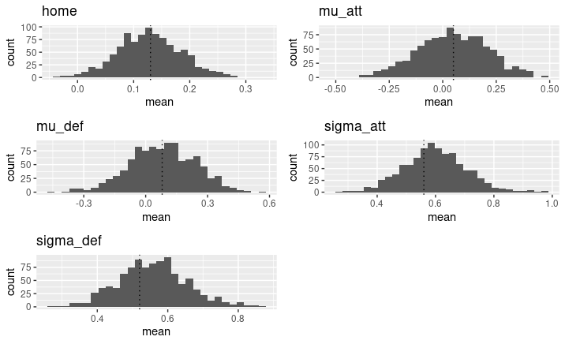
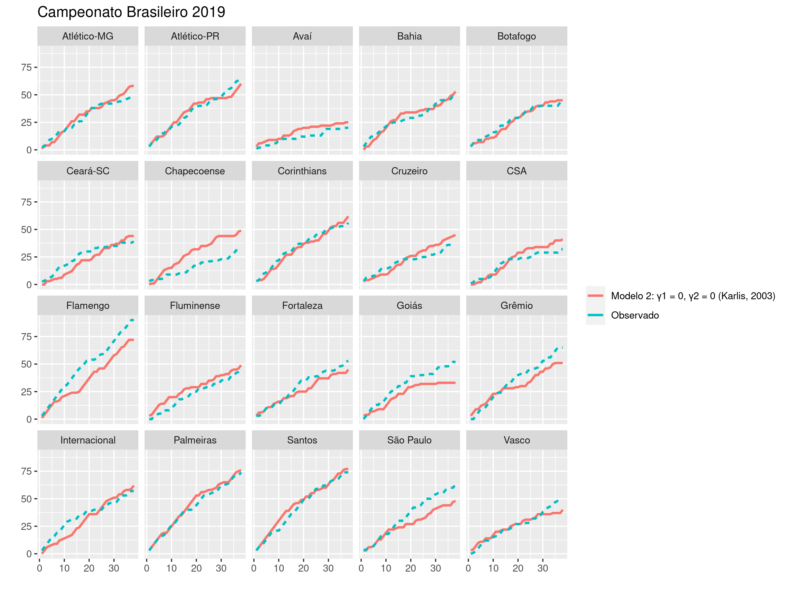
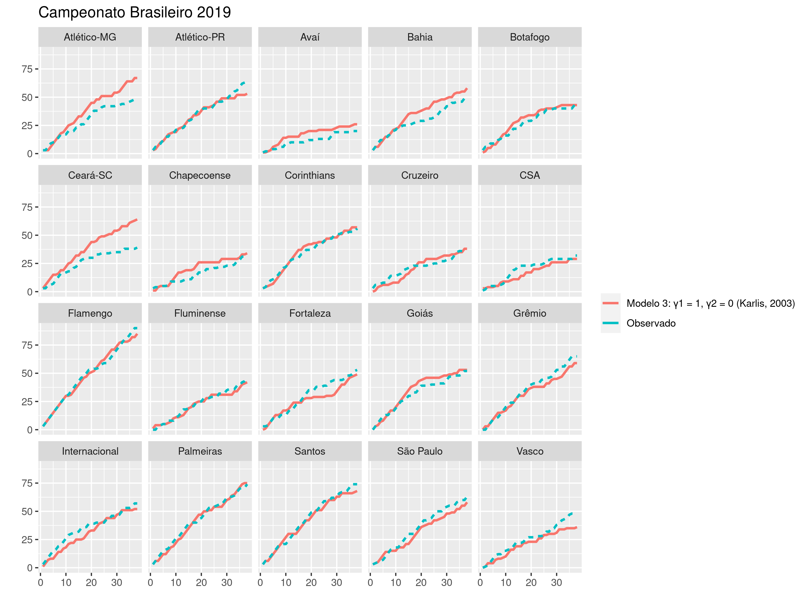

```{r setup, include=FALSE}
library(kableExtra)
library(knitr)
library(readr)
library(tidyverse)

opts_chunk$set(echo = FALSE)
options(knitr.kable.NA = '')
source("src/wrangling_functions.R")
```

## Introdução

Desde a década de 80, modelos estatísticos são aplicados em problemas relacionados à esportes. Um exemplo é prever o número de gols marcados por um time em uma partida de futebol, que podem ser modelados como dados de **contagem**. 

## Introdução 

A distribuição de Poisson é uma das mais utilizadas para esse tipo de problema. Serão apresentados 5 modelos propostos na literatura para prever o número de gols nas partidas do Campeonato Brasileiro dos anos 2019.

Os modelos foram implementados no Stan, um software para amostrar modelos bayesianos, juntamente com o R.

## Modelo 1 

O modelo de efeitos aleatórios proposto por @baio_bayesian_2010 é definido da seguinte forma:

Seja $\mathbf{y} = (y_{g1}, y_{g2})$ um um vetor de contagens, que são modelados como Poisson independentes condicionais aos parâmetros $\mathbf{\theta} = (\theta_{g1}, \theta_{g2})$

$$
y_{gj}|\theta_{gj} \sim Poisson(\theta_{gj})
$$

No qual $j=1$ representa o time jogando em casa e $j=2$ indica a equipe visitante. Assumindo um modelo de efeitos aleatórios com função de ligação log, temos:

$$
\log \theta_{g1} = home + att_{h(g)} + def_{a(g)}
$$
$$
\log \theta_{g2} = att_{a(g)} + def_{h(g)}
$$
Os índices $h(g)$ representa o time que está jogando em casa no g-ésimo jogo e $a(g)$ o visitante, indo de 1 a $T = 20$.

## Priori

A escolha das distribuições a priori do parâmetros se basearam no artigo e foram adaptadas para as parametrizações e particularidades do Stan.

Parâmetros

- $home \sim Normal(0, 10)$
- $att_t \sim Normal(\mu_{att}, \sigma_{att})$
- $def_t \sim Normal(\mu_{def}, \sigma_{def})$

Hiperparâmetros

- $\mu_{att} \sim Normal(0, 10)$
- $\mu_{def} \sim Normal(0, 10)$
- $\sigma_{att} \sim Cauchy(0, 2.5)$
- $\sigma_{def} \sim Cauchy(0, 2.5)$

## 

Como **restrição de identificabilidade** nos efeitos específicos de cada time, apenas para o último time foi definido que 

$att_{t=20} = 0$
$def_{t=20} = 0$

e, portanto, o vigésimo time é referência para interpretação dos efeitos das outras equipes. Essa restrição foi aplicada para todos os modelos deste trabalho.

## Simulação

Para verificar a implementação e qualidade de estimação dos modelos, foi feita uma simulação com 1000 banco de dados de tamanho 380, representando o número de jogos de um campeonato com 20 times.



## Simulação

Uma única cadeia de Markov foi utilizada para obter as amostras da distribuição a posteriori, com 5000 iterações no total, sendo 2500 de warmup/burnin.


## Dados 

Os dados do Campeonato Brasileiro foram disponibilizados por Gomide e Gualberto no repositório **caRtola**, disponível no Github. O formato dos dados é o seguinte:


No ano de 2019, o topo da tabela foi formado, respectivamente, por:

- Flamengo, Santos, Palmeiras e Grêmio 

Já os times rebaixados foram:

- Cruzeiro, CSA, Chapecoense e Avaí

## Ajuste


## Ajuste 

- Referência: Fortaleza

```{r}
df <- read_rds("artifacts/2019/summary_m1.rds")
map_teams <- read_rds("artifacts/2019/index_teams.rds")
df <- cbind(df, map_teams) 

df[1:20, ] |> 
  select(home_team_name, mean, median, sd, q5, q95) |> 
  rename("Time" = home_team_name,
         "Média" = mean,
         "Mediana" = median, 
         "Desvio-padrão" = sd,
         "5%" = q5,
         "95%" = q95) |> 
  filter(Time %in% c("Flamengo", "Palmeiras", "CSA", "Ceará", "Fluminense", "")) |> 
kable(digits = 3, booktabs = T) |> 
  kable_styling(font_size = 9)


df[21:40, ] |> 
  select(home_team_name, mean, median, sd, q5, q95) |> 
  rename("Time" = home_team_name,
         "Média" = mean,
         "Mediana" = median, 
         "Desvio-padrão" = sd,
         "5%" = q5,
         "95%" = q95) |> 
  filter(Time %in% c("Flamengo", "Palmeiras", "CSA", "Ceará", "Fluminense")) |> 
  kable(booktabs = T, digits = 3) |> 
  kable_styling(font_size = 9)
```


## Modelo 2 

@karlis_analysis_2003 propõe um modelo baseado na distribuição de Poisson bivariada, em que são definidas três variáveis aleatórias latentes $X_1, X_2, X_3$ que seguem, independentemente, uma Poisson com parâmetros $\lambda_1, \lambda_2, \lambda_3$. 

Então, as variáveis aleatórias $X = X_1 + X_3$ e $Y = X_2 + X_3$ seguem conjuntamente uma distribuição de Poisson bivariada. Marginalmente, $E(X) = \lambda_1 + \lambda_3$ e $E(Y) = \lambda_2 + \lambda_3$. Ainda, $cov(X, Y) = \lambda_3$ e então tem-se uma medida de interdependência entre as variáveis aleatórias. 

## Modelo 2

Utilizando o resultado anterior, podemos definir:

$$
X_i \sim Poisson(\lambda_{1i})
$$
$$
Y_i \sim Poisson(\lambda_{2i})
$$
com $i$ indicando o i-ésimo jogo. Daí, temos os preditores lineares definidos como:

$$
\log(\lambda_{1i}) = \mu + home + att_{h_i} + def_{g_i}
$$
$$
\log(\lambda_{2i}) = \mu + att_{g_i} + def_{h_i}
$$
$$
\log(\lambda_{3i}) = \alpha + \gamma_1\alpha_{h_i}^{home} + \gamma_2\alpha_{g_i}^{away}
$$
no qual as variáveis _dummy_ $\gamma_1$ e $\gamma_2$ indicam quais efeitos queremos incluir na correlação entre o número de gols do time mandante e visitante.

## Modelo 2

Para o modelo 2 que estamos considerando, $\gamma_1 = \gamma_2 = 0$. Ou seja, o parâmetro de correlação $\lambda_{3i}$ depende apenas de um efeito fixo, $\alpha$.

Originalmente, o artigo considera que o efeito de ataque e defesa para cada time é **fixo**, fazendo com que o modelo tenha um número muito grande de parâmetros. Por isso, o modelo proposto foi adaptado e ataque e defesa foram tratados como efeitos aleatórios, além da inclusão prioris para os parâmetros.

## Priori

Parâmetros

- $\mu \sim Normal(0, 10)$
- $home \sim Normal(0, 10)$
- $att_t \sim Normal(0, \sigma_{att})$
- $def_t \sim Normal(0, \sigma_{def})$
- $\alpha \sim Normal(0, 1)$

Hiperparâmetros

- $\sigma_{att} \sim Cauchy(0, 2.5)$
- $\sigma_{def} \sim Cauchy(0, 2.5)$

## Simulação

Uma simulação para o modelo 2 foi feita com 1000 banco de dados de tamanho 380, representando o número de jogos de um campeonato com 20 times.


## Ajuste


## Ajuste

```{r}
df <- read_rds("artifacts/2019/summary_m2.rds")
map_teams <- read_rds("artifacts/2019/index_teams.rds")
df <- cbind(df, map_teams) 

df[1:20, ] |> 
  select(home_team_name, mean, median, sd, q5, q95) |> 
  rename("Time" = home_team_name,
         "Média" = mean,
         "Mediana" = median, 
         "Desvio-padrão" = sd,
         "5%" = q5,
         "95%" = q95) |> 
  filter(Time %in% c("Flamengo", "Palmeiras", "CSA", "Ceará", "Fluminense", "")) |> 
kable(digits = 3, booktabs = T) |> 
  kable_styling(font_size = 9)


df[21:40, ] |> 
  select(home_team_name, mean, median, sd, q5, q95) |> 
  rename("Time" = home_team_name,
         "Média" = mean,
         "Mediana" = median, 
         "Desvio-padrão" = sd,
         "5%" = q5,
         "95%" = q95) |> 
  filter(Time %in% c("Flamengo", "Palmeiras", "CSA", "Ceará", "Fluminense")) |> 
  kable(booktabs = T, digits = 3) |> 
  kable_styling(font_size = 9)
```

## Ajuste 


## Modelo 3 

Baseado na definição do modelo 2, o modelo 3 é definido com $\gamma_1 = 1, \gamma_2 = 0$, com parâmetro de correlação $\lambda_{3i}$ sendo a soma do efeito **fixo** $\alpha$ mais um efeito que depende do time **mandante**.

## Modelo 3


## Ajuste
 

## Modelo 4

O modelo 4 inclui todos os efeitos na correlação: o efeito **fixo** $\alpha$, um efeito que depende do time da **casa** e também um efeito para o time **visitante**. Assim, $\gamma_1 = 1, \gamma_2 = 1$. 

## Ajuste
  

## Modelo 5

Já o modelo 5 inclui apenas o efeito fixo e o efeito do time **visitante**, definido com $\gamma_1 = 0, \gamma_2 = 1$.

## Ajuste


## Ajuste 

```{r}
df <- read_rds("artifacts/2019/summary_m5.rds")
map_teams <- read_rds("artifacts/2019/index_teams.rds")
df <- cbind(df, map_teams) 

df[1:20, ] |> 
  select(home_team_name, mean, median, sd, q5, q95) |> 
  rename("Time" = home_team_name,
         "Média" = mean,
         "Mediana" = median, 
         "Desvio-padrão" = sd,
         "5%" = q5,
         "95%" = q95) |> 
  filter(Time %in% c("Flamengo", "Palmeiras", "CSA", "Ceará", "Fluminense", "")) |> 
kable(digits = 3, booktabs = T) |> 
  kable_styling(font_size = 9)


df[21:40, ] |> 
  select(home_team_name, mean, median, sd, q5, q95) |> 
  rename("Time" = home_team_name,
         "Média" = mean,
         "Mediana" = median, 
         "Desvio-padrão" = sd,
         "5%" = q5,
         "95%" = q95) |> 
  filter(Time %in% c("Flamengo", "Palmeiras", "CSA", "Ceará", "Fluminense")) |> 
  kable(booktabs = T, digits = 3) |> 
  kable_styling(font_size = 9)
```


## Modelo 6 

O sexto modelo é uma extensão do modelo 1, incluindo uma mistura de 3 componentes, representando categorias das habilidades do time. A partir disso, o efeito de ataque e defesa são definidos em função do grupo que a equipe pertence.

O ataque e defesa seguem uma distribuição t-Student com 4 graus de liberdade, **ponderados** pela probababilidade do time pertencer a um dos três grupos: (1) final da tabela, (2) meio da tabela e (3) topo da tabela [@baio_bayesian_2010].

$$
att_t = \sum_{k=1}^3 \pi^{att}_{kt} \times t(\mu^{att}_k, \tau^{att}_k, \nu)
$$
$$
def_t = \sum_{k=1}^3 \pi^{def}_{kt} \times t(\mu^{def}_k, \tau^{def}_k, \nu)
$$

## Priori

- $\pi_{att} \sim Dirichlet([1, 1, 1])$ e $\pi_{def} \sim Dirichlet([1, 1, 1])$
- $home \sim Normal(0, 10)$
- Para todos os grupos, $\sigma_{att} \sim Cauchy(0, 2.5)$ e $\sigma_{def} \sim Cauchy(0, 2.5)$

Grupo 1 

- $\mu_1^{att} \sim trunc Normal(0, 10, -3, 0)$
- $\mu_1^{def} \sim trunc Normal(0, 10, 0, 3)$

Grupo 2 

- $\mu_2^{att} \sim trunc Normal(0, 0.01)$
- $\mu_2^{def} \sim trunc Normal(0, 0.01)$

Grupo 3 

- $\mu_3^{att} \sim trunc Normal(0, 10, 0, 3)$
- $\mu_3^{def} \sim trunc Normal (0, 10, -3, 0)$

## Modelo 6

As cadeias apresentaram problemas e foram ajustadas com parâmetros diferentes: 2 cadeias, thin = 5 e 10000 iterações.


## Ajuste


## Comparação: EQM

```{r}
df <- read_rds("artifacts/2019/pontuacao_all.rds") 
df <- df |>
  rename("Time" = team_name,
         "Real" = score_obs,
         "M1" = score_est_m1, 
         "M2" = score_est_m2,
         "M3" = score_est_m3,
         "M4" = score_est_m4,
         "M5" = score_est_m5,
         "M6" = score_est_m6)

df2 <- df |> 
  select(starts_with("M")) |> 
  map_df(mse, actual = df$Real) |> 
  mutate(Time = NA, Real = NA) |> 
  mutate_if(is.numeric, round, 1)

df <- df |> 
  mutate_if(is.numeric, as.character)

rbind(df, df2) |> 
  kable(booktabs = T, digits = 1) |> 
  kable_styling(position = "center", 
                latex_options = "hold_position", 
                font_size = 7) |>
  row_spec(c(3, 7, 9, 10, 11, 15, 17, 18), bold = TRUE) 
```


## Comparação: LOO-CV

- $elpd_{loo} = \sum_{i=1}^n \log p(y_i | y_{-i})$, onde $p(y_i|y_{-i}) = \int p(y_i | \theta) p(\theta|y_{-i}d\theta)$ é a densidade preditiva [@vehtari_practical_2015]

- $LOO_{ic} = -2 \times elpd_{loo}$

- Quanto menor, melhor

```{r}
read_rds("artifacts/2019/loo_compare_all_models.rds") |> 
  as_tibble(rownames = "model") |> 
  select(model, elpd_diff, se_diff, looic, se_looic) |> 
  mutate_if(is.numeric, round, 3) |> 
  kable(format = "latex", booktabs = TRUE)
```

## Considerações 

- Binomial negativa, para os casos de superdispersão
- @benz_estimating_2020 analisa o efeito de jogar em casa durante a pandemia
- Campeonatos de outros anos
- Limitações dos modelos baseados na Poisson bivariada
- Melhoria e correção do modelo de mistura

## Referências