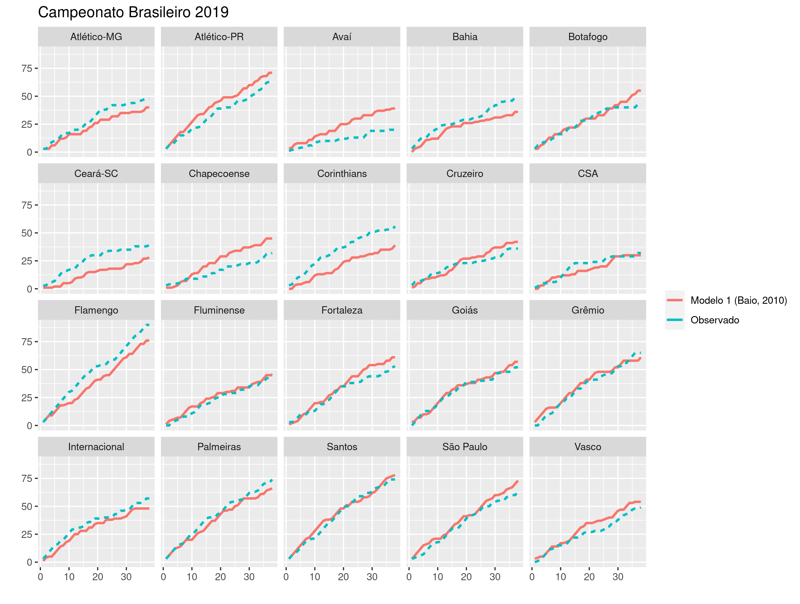
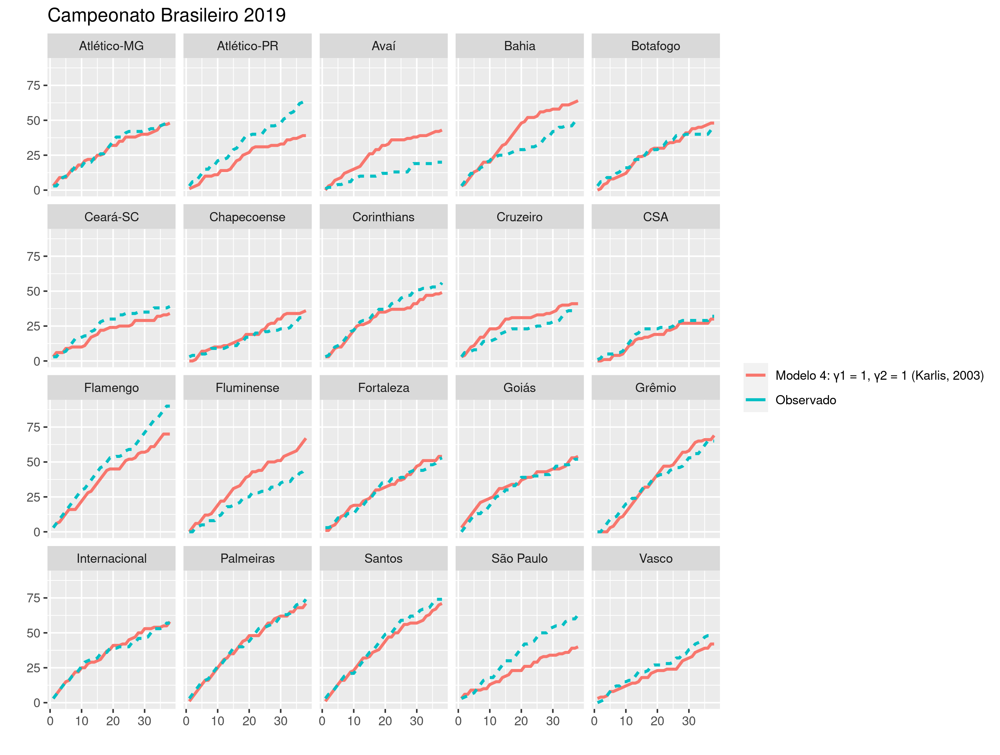
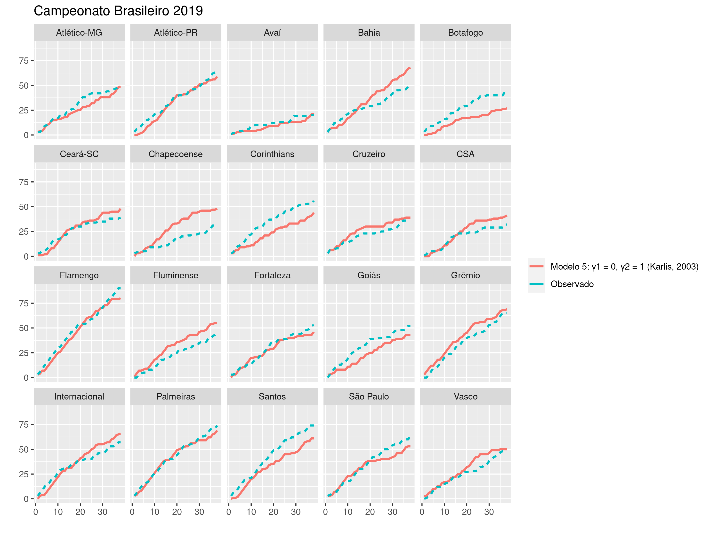

```{r setup, include=FALSE}
library(kableExtra)
library(knitr)

opts_chunk$set(echo = FALSE)
```

## Introdução

Desde a década de 80, modelos estatísticos são aplicados em problemas relacionados à esportes. Um exemplo é prever o número de gols marcados por um time em uma partida de futebol, que podem ser modelados como dados de **contagem**. 

## Introdução 

A distribuição de Poisson é uma das mais utilizadas para esse tipo de problema. Serão apresentados 5 modelos propostos na literatura para prever o número de gols nas partidas do Campeonato Brasileiro dos anos 2019, 2020 e 2021.

Os modelos foram implementados no Stan, um software para amostrar modelos bayesianos. O RStan foi utilizado como interface entre o Stan e o R. 

## Modelo 1 

O modelo de efeitos aleatórios proposto por @baio_bayesian_2010 é definido da seguinte forma:

Seja $\mathbf{y} = (y_{g1}, y_{g2})$ um um vetor de contagens, que são modelados como Poisson independentes condicionais aos parâmetros $\mathbf{\theta} = (\theta_{g1}, \theta_{g2})$

$$
y_{gj}|\theta_{gj} \sim Poisson(\theta_{gj})
$$

No qual $j=1$ representa o time jogando em casa e $j=2$ indica a equipe visitante. Assumindo um modelo de efeitos aleatórios com função de ligação log, temos:

$$
\log \theta_{g1} = home + att_{h(g)} + def_{a(g)}
$$
$$
\log \theta_{g2} = att_{a(g)} + def_{h(g)}
$$
Os índices $h(g)$ representa o time que está jogando em casa no g-ésimo jogo e $a(g)$ o visitante, indo de 1 a $T = 20$.

## Priori

A escolha das distribuições a priori do parâmetros se basearam no artigo e foram adaptadas para as parametrizações e particularidades do Stan.

Parâmetros

- $home \sim Normal(0, 10)$
- $att_t \sim Normal(\mu_{att}, \sigma_{att})$
- $def_t \sim Normal(\mu_{def}, \sigma_{def})$

Hiperparâmetros

- $\mu_{att} \sim Normal(0, 10)$
- $\mu_{def} \sim Normal(0, 10)$
- $\sigma_{att} \sim Cauchy(0, 2.5)$
- $\sigma_{def} \sim Cauchy(0, 2.5)$

## 

Como **restrição de identificabilidade** nos efeitos específicos de cada time, apenas para o último time foi definido que 

$att_{t=20} = 0$
$def_{t=20} = 0$

e, portanto, o vigésimo time é referência para interpretação dos efeitos das outras equipes. Essa restrição foi aplicada para todos os modelos deste trabalho.

## Simulação

Para verificar a implementação e qualidade de estimação dos modelos, foi feita uma simulação com 1000 banco de dados de tamanho 380, representando o número de jogos de um campeonato com 20 times.


## Simulação

Uma única cadeia de Markov foi utilizada para obter as amostras da distribuição a posteriori, com 5000 iterações no total, sendo 2500 de warmup/burnin.


## Ajuste 

Os dados do Campeonato Brasileiro foram disponibilizados por Gomide e Gualberto no repositório **caRtola**, disponível no Github. O formato dos dados é o seguinte:


## Ajuste: 2019


## Modelo 2 

Karlis e Ntzoufras (2003) propõe um modelo baseado na distribuição de Poisson bivariada, em que são definidas três variáveis aleatórias latentes $X_1, X_2, X_3$ que seguem, independentemente, uma Poisson com parâmetros $\lambda_1, \lambda_2, \lambda_3$. 

Então, as variáveis aleatórias $X = X_1 + X_3$ e $Y = X_2 + X_3$ seguem conjuntamente uma distribuição de Poisson bivariada. Marginalmente, $E(X) = \lambda_1 + \lambda_3$ e $E(Y) = \lambda_2 + \lambda_3$. Ainda, $cov(X, Y) = \lambda_3$ e então tem-se uma medida de interdependência entre as variáveis aleatórias. 

## Modelo 2

Utilizando o resultado anterior, podemos definir:

$$
X_i \sim Poisson(\lambda_{1i})
$$
$$
Y_i \sim Poisson(\lambda_{2i})
$$
com $i$ indicando o i-ésimo jogo. Daí, temos os preditores lineares definidos como:

$$
\log(\lambda_{1i}) = \mu + home + att_{h_i} + def_{g_i}
$$
$$
\log(\lambda_{2i}) = \mu + att_{g_i} + def_{h_i}
$$
$$
\log(\lambda_{3i}) = \alpha + \gamma_1\alpha_{h_i}^{home} + \gamma_2\alpha_{g_i}^{away}
$$
no qual as variáveis _dummy_ $\gamma_1$ e $\gamma_2$ são indicadoras de quais efeitos queremos incluir na correlação entre o número de gols do time mandante e visitante.

## Modelo 2

Para o modelo 2 que estamos considerando, $\gamma_1 = \gamma_2 = 0$. Ou seja, o parâmetro de correlação $\lambda_{3i}$ depende apenas de um efeito fixo, $\alpha$.

Originalmente, o artigo considera que o efeito de ataque e defesa para cada time é **fixo**, fazendo com que o modelo tenha um número muito grande de parâmetros. Por isso, o modelo proposto foi adaptado e ataque e defesa foram tratados como efeitos aleatórios, além da definição de prioris para os parâmetros.

## Priori

Parâmetros

- $\mu \sim Normal(0, 10)$
- $home \sim Normal(0, 10)$
- $att_t \sim Normal(0, \sigma_{att})$
- $def_t \sim Normal(0, \sigma_{def})$
- $\alpha \sim Normal(0, 1)$

Hiperparâmetros

- $\sigma_{att} \sim Cauchy(0, 2.5)$
- $\sigma_{def} \sim Cauchy(0, 2.5)$

## Simulação

Uma simulação para o modelo 2 foi feita com 1000 banco de dados de tamanho 380, representando o número de jogos de um campeonato com 20 times.


## Ajuste: 2019


## Modelo 3 

Baseado na definição do modelo 2, o modelo 3 é definido com $\gamma_1 = 1, \gamma_2 = 0$, com parâmetro de correlação $\lambda_{3i}$ sendo a soma do efeito **fixo** $\alpha$ mais um efeito que depende do time **mandante**.

## Ajuste: 2019
 

## Modelo 4

O modelo 4 inclui todos os efeitos na correlação: o efeito **fixo** $\alpha$, um efeito que depende do time da **casa** e também um efeito para o time **visitante**. Assim, $\gamma_1 = 1, \gamma_2 = 1$. 

## Ajuste: 2019
  

## Modelo 5

Já o modelo 5 inclui apenas o efeito fixo e o efeito do time **visitante**, definido com $\gamma_1 = 0, \gamma_2 = 1$.

## Ajuste: 2019

## Modelo 6 

O modelo de mistura apresentado por @baio_bayesian_2010 permite contornar o problema de encolhimento

## Comparação 

- Medidas de qualidade relativa do modelo 

## Outros modelos 

- Binomial negativa, para os casos de superdispersão
- Poisson inflada de zeros

## Referências