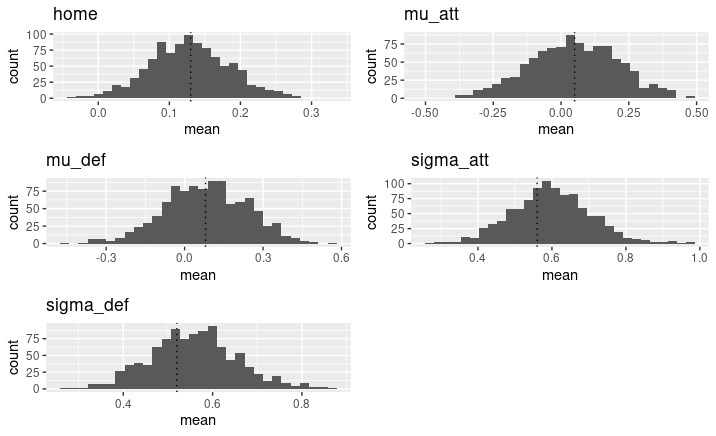
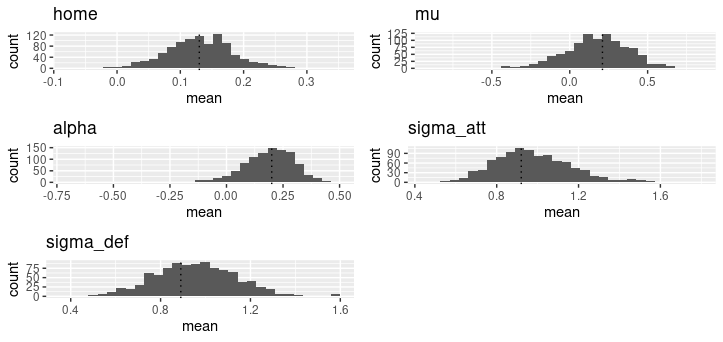

```{r setup, include=FALSE}
knitr::opts_chunk$set(echo = FALSE)

library(kableExtra)
library(knitr)
library(tidyverse)
```

# 1. Introdução 

Modelos estatísticos podem ser aplicados em diferentes áreas do conhecimento. Uma delas, que tem crescido nos últimos anos, é a análise de dados de competições e eventos esportivos. O número de gols marcados, por exemplo, pode ser tratado como dados de contagem e representados por modelos discretos. Estes modelos são vastamente representados na literatura desde a década de 80, como em @pollard_69.9_1985 que utiliza a distribuição Binomial Negativa, enquanto @baxter_discriminating_1988 apresentam as diferenças entre a Binomial Negativa e Poisson para modelar o placar de partidas de futebol. Tais modelos desconsideram uma estrutura de correlação entre os gols de cada oponente. @karlis_analysis_2003 sugere a distribuição Poisson bivariada, que permite uma correlação entre o número de gols marcados pelo mandante e visitante e, ainda, há uma proposta de um modelo bayesiano hierárquico com efeitos aleatórios como definido por @baio_bayesian_2010. Neste trabalho, são implementados, ajustados e comparados modelos baseados na distribuição Poisson para dados do Campeonato Brasileiro de 2019, 2020 e 2021, obtido em @dados_brasileirao utilizando o software Stan e RStan para inferência bayesiana. 

# 2. Modelos 
## Modelo 1

@baio_bayesian_2010 sugerem um modelo bayesiano hierárquico para os gols marcados na partida. No modelo proposto, o número de gols marcados segue uma distribuição Poisson condicionalmente independentes, em que a correlação é incluída por meio dos hiperparâmetros. A distribuição Poisson é vastamente utilizada para problemas de contagem e amplamente aplicada à análises esportivas como sugerem M. Dixon and S. Coles (2007) e D. Karlis and I. Ntzoufras (2003), dentre outros autores.

O vetor $\mathbf{y} = (y_{g1}, y_{g2})$ como um vetor de contagens, podemos tomar 

$$
y_{gj}|\theta_{gj} \sim Poisson(\theta_{gj})
$$
o vetor tendo uma distribuição Poisson condicional aos parâmetros $\mathbf{\theta}=(\theta_{g1}, \theta_{g2})$, que representam a taxa de pontuação no g-ésimo jogo para o mandante, representado por $j=1$ e o visitante $j=2$.

Assumindo um modelo log-linear de efeitos aleatórios, tem-se 
$$
\log \theta_{g1} = home + att_{h(g)} + def_{a(g)}
$$
$$
\log \theta_{g2} = att_{a(g)} + def_{h(g)}
$$
em que o parâmetro *home* é um efeito fixo representando a vantagem de ter um jogo em casa e a taxa de pontuação considera o *ataque* e a *defesa* dos dois times que estão jogando. Os índices representam o time que da casa $h(g)$ e o time visitante $a(g)$ no g-ésimo jogo.

### Priori

Considerando que o modelo proposto segue a abordagem bayesiana, os efeitos aleatórios são objetos aleatórios de interesse e é apropriado definir uma distribuição à priori para cada um deles. As prioris sugeridas pelos autores são:

$$
home \sim Normal(0, 0.0001)
$$
$$
att_t \sim Normal(\mu_{att}, \tau_{att})
$$
$$
def_t \sim Normal(\mu_{def}, \tau_{def})
$$
Sendo t cada um dos times do campeonato. A Normal é definida pela média e precisão. O modelo original foi implementado no WinBUGS, que utiliza a mesma parametrização apresentada no artigo. Como priori para $\mu$ é definida uma $Normal(0, 0.0001)$ tanto para o ataque quanto defesa, e $Gamma(0.1, 0.1)$ para os $\tau$ de ataque e defesa.

Aqui, o modelo foi implementado no Stan e uma adaptação foi necessária, considerando que a parametrização do software é diferente, com a Normal definida pela média e desvio padrão. Passamos a ter: 

$$
att_t \sim Normal(\mu_{att}, \sigma_{att})
$$
$$
def_t \sim Normal(\mu_{def}, \sigma_{def})
$$

Conforme demonstrado por por @gelman_weakly_2008 e comentado em @apostilaStan, a priori não-informativa recomendada é uma Cauchy, portanto: 

$$
\sigma_{att} \sim Cauchy(0, 2.5)
$$
$$
\sigma_{def} \sim Cauchy(0, 2.5)
$$

Para garantir a identificabilidade do modelo, os autores sugerem a seguinte restrição nos parâmetros específicos de cada time: 

$$
\sum_{t=1}^{T} att_t = 0
$$
$$
\sum_{t=1}^T def_t = 0
$$
Ainda é proposto a restrição em que um dos times é definido como ataque e defesa iguais a 0, o que implica interpretar os parâmetros para os outros times utilizando como referência o time de base. A proposta foi implementada neste trabalho, então, a restrição de identificabilidade é: 
$$
att_T = 0
$$
$$
def_T = 0
$$
Tal restrição foi fundamental para que as cadeias de Markov convergissem, além de ser um método mais rápido para a execução do código.

### Simulação

Para checar a implementação dos modelos e estimação correta dos parâmetros, foi feita uma simulação com 1000 réplicas de tamanho 380, que é o número de jogos de um campeonato com 20 times. Os parâmetros do modelo usados para simulação são definidos como:

- $home = 0.13$
- $\mu_{att} = 0.05$
- $\mu_{def} = 0.08$
- $\sigma_{att} = 0.56$
- $\sigma_{def} = 0.52$



Observa-se que as distribuições da média da distribuição a posteriori dos parâmetros estão centradas em torno dos valores reais. 

#### Diagnóstico de convergência da simulação

As simulações foram realizadas com apenas 01 cadeia e 5000 interações. O gráfico traceplot mostra que a cadeia converge e consegue caminhar pelo espaço paramétrico.


Outra estatística útil é o $\hat{R}$, que próximo de 1 é condição para convergência. Todos os parâmetros apresentaram $\hat{R}$ próximo de 1, sendo o menor $\hat{R} = 0.9995999$ e maior $\hat{R} = 1.002963$.

### Ajuste 

Para verificar o comportamento do modelo com um conjunto de dados reais, assim como no artigo original o modelo é ajustado para dados do campeonato italiano, aqui ele será testado com dados do Campeonato Brasileiro "Brasileirão" ano de 2019. 

Os dados foram disponibilizados por @dados_brasileirao no Github, com o seguinte formato:

```{r}
df <- read_rds("/home/mariana/Documents/pessoal/monografia/soccer-models/dataframe_head.rds")

kable(df, booktabs = T) |> 
  kable_styling(position = "center", latex_options = "hold_position")
```

As colunas _home_team_index_ e _away_team_index_ foram criadas atribuindo um valor inteiro ordinal para cada time, seguindo a notação do modelo.

Comparando a pontuação **acumulada** ao longo do campeonato observada e a pontuação estimada pelo modelo, tem-se o seguinte comportamento para cada time:


O desempenho do time 5 foi superestimado pelo modelo, enquanto o contrário aconteceu para o time 9, seu desempenho foi subestimado pelo modelo hierárquico. Os times 2, 12, 15 e 14 apresentam a pontuação acumulada mais próxima entre o estimado e o observado.

```{r}

read_rds("artifacts/pontuacao_total_m1.rds") |> 
  rename("Time" = team_name,
         "Pontuação observada" = score_obs, 
         "Pontuação estimada (Modelo 1)" = score_est_m1 ) |>
  kable(booktabs = T) |> 
  kable_styling(position = "center", 
                latex_options = "hold_position")
```

Santos foi time com maior pontuação atribuída pelo modelo, estimando exatamente a pontuação obtida pelo time no campeonato e, assim, sendo o campeão segundo o modelo. Porém, o campeão de 2019 foi o Flamengo e o vice-campeão o Santos.

#### Diagnóstico de convergência do ajuste

## Modelo 2

A distribuição Poisson é um dos modelos mais utilizados na literatura para análises do número de gols marcados em uma partida de futebol. As variáveis-resposta são usualmente modeladas como duas Poisson independentes, considerando que o número de gols de um time não afeta o número de gols do outro time. Tal suposição não é muito razoável, considerando, por exemplo, que a força de defesa de um time interfere nas oportunidades para a marcação de gols do oponente. A partir disso, @karlis_analysis_2003 sugerem a modelagem do número de gols a partir de uma Poisson bivariada, que permite a inclusão de uma covariância positiva que faz o papel da dependência entre as duas variáveis Poisson que, marginalmente, são independentes.

Sendo $X = X_1 + X_3$ e $Y = X_2 + X_3$, duas variáveis aleatórias com $X_i \sim Poisson(\lambda_i)$, então $X$ e $Y$ seguem conjuntamente uma Poisson bivariada $\mathbf{BP}(\lambda_1, \lambda_2, \lambda_3)$.

Conforme mencionado anteriormente, tem-se duas Poisson independentes marginalmente com $E(X) = \lambda_1 + \lambda_3$ e $Y = \lambda_2 + \lambda_3$. Além disso, $cov(X, Y) = \lambda_3$. Se $\lambda_3 = 0$, então temos simplesmente duas Poisson independentes. Os autores sugerem que o parâmetro $\lambda_3$ representam as condições de jogo comuns aos dois times da partida, como ritmo do jogo e condições climáticas. 

Contudo, tal modelagem tem uma limitação: levando em conta que a covariância entre X e Y também é o parâmetro da Poisson e o espaço paramétrico está definido em $(0, +\infty)$, a covariância também está limitada em $(0, +\infty)$. Isso significa que à medida que o número de gols de um dos times aumenta, o do outro time não tende a seguir a relação inversa e, por isso, a interpretação de condições favoráveis aos dois times simultaneamente. Porém, é razoável pensar que essa relação pode ser negativa, com o aumento do comportamento ofensivo de um time e a outra equipe sem muitas oportunidades de marcar gols.

Definindo diretamente o modelo aplicado à futebol, temos que para cada jogo i

$$
X_i \sim Poisson(\lambda_{1i})
$$
$$
Y_i \sim Poisson(\lambda_{2i})
$$
e usando a função de ligação log para os preditores lineares, tem-se:
$$
\log(\lambda_{1i}) = \mu + home + att_{h_i} + def_{g_i}
$$
$$
\log(\lambda_{2i}) = \mu + att_{g_i} + def_{h_i}
$$
Para a inclusão da covariância como $\lambda_3$, Karlis (2003) apresenta o preditor linear que permite combinar diferentes modelos: 
$$
\log(\lambda_{3i}) = \alpha^{con} + \gamma_1\alpha_{h_i}^{home} + \gamma_2\alpha_{g_i}^{away}
$$

No qual $\gamma_j$ é uma variável _dummy_, indicando quais parâmetros serão incluídos no modelo de interesse. Para o modelo 2, $\gamma_1 = \gamma_2 = 0$, ou seja, tem-se apenas uma covariância constante. 

No artigo original, ataque e defesa são tratados como efeitos fixos, portanto o número de parâmetros é o número de times multiplicado por dois mais 1, para o parâmetro que representa a covariância. Para os dados utilizados por Karlis do Campeonato Italiano de 1991-1992, são 37 parâmetros, enquanto para o Campeonato Brasileiro de 2019 seriam 41 parâmetros. Por isso, na adaptação do modelo, ataque e defesa foram abordados como efeitos aleatórios.

A restrição de identificabilidade dos efeitos de ataque e defesa é a mesma do modelo 1, com o efeito do último time definido como:
$$
att_T = 0
$$
$$
def_T = 0
$$

### Priori

$$home \sim Normal(0, 10)$$
$$\sigma_{att} \sim Cauchy(0, 2.5)$$
$$\sigma_{def} \sim Cauchy(0, 2.5)$$
$$\mu \sim Normal(0, 10)$$
$$\alpha \sim Normal(0, 1)$$
$$\alpha^{home} \sim Normal(0, 1)$$
$$\alpha^{away} \sim Normal(0, 1)$$

### Simulação

Com o objetivo de verificar a estimação certa dos parâmetros, também foi feita uma simulação com 1000 réplicas de tamanho 380, representando o número de jogos de um campeonato com 20 times. Neste modelo, os parâmetros para simulação são definidos como:

- $home = 0.13$
- $\mu = 0.21$
- $\alpha = 0.20$
- $\sigma_{att} = 0.92$
- $\sigma_{def} = 0.80$

A partir dos resultados dos histogramas obtidos na simulação, tem-se que o modelo estima corretamente os parâmetros.



### Diagnóstico de convergência da simulação

As simulações foram realizadas com apenas 01 cadeia e 5000 interações. O gráfico traceplot mostra que a cadeia converge e consegue caminhar pelo espaço paramétrico.


A estatística $\hat{R}$ para os parâmetros se mostrou próxima de 1, sendo o menor $\hat{R} = 0.9995999$ e maior $\hat{R} = 1.002963$.

### Ajuste

Assim como o primeiro modelo, o modelo 2 foi ajustado para o Campeonato Brasileiro de 2019. Neste modelo, $\gamma_1=\gamma_2=0$. 


```{r}
pontuacao_m2 <- read_rds("artifacts/pontuacao_total_m2.rds")

kable(pontuacao_m2, align = 'c', booktabs = T) |> 
  kable_styling(position = "center", latex_options = "hold_position")
```

O modelo 2 tem o Flamengo como maior pontuador ao longo do campeonato, acertando o vencedor. O segundo lugar ficou entre o Santos e Grêmio, segundo e quarto colocado respectivamente.

Além dos campeões, os quatro últimos times são rebaixados para a segunda divisão. Nesse modelo, há um empate na pontuação final dos times Cruzeiro e Ceará e, seguindo pelo critério do maior saldo de gols, o Cruzeiro seria rebaixado juntamente com Bahia, Chapecoense e CSA. Os times rebaixados no ano foram Cruzeiro, CSA, Chapecoense e Avaí, ou seja, o modelo 2 errou apenas uma das equipes.

## Modelo 3

O modelo três é uma extensão do modelo 2, no qual $\gamma_1 = 1, \gamma_2=0$. Não foi feita uma simulação para o modelo por limitações de memória no computador.


## Modelo 4

O modelo quatro é uma extensão do segundo modelo, no qual $\gamma_1=1, \gamma_2=1$. Também não foi realizada uma simulação pela mesma razão do modelo 3.


## Modelo 5

O modelo quatro é uma extensão do segundo modelo, no qual $\gamma_1=0, \gamma_2=1$. Também não foi realizada uma simulação pela mesma razão do modelo 3.


# 3. Comparação dos modelos


Como o cálculo do LOO-CV é feito baseado na log-verossimilhança de cada observação, algumas delas podem ser muito influentes. Isso é especialmente sensível quando temos distribuições com caudas longas. Para isso, é calculado o PSIS.

# 4. Outros modelos

Um possível problema com modelos hierárquicos é um efeito de encolhimento, no qual observações extremas são arrastadas para a média global. Esse efeito faz com que equipes com um desempenho muito bom, que estão no topo da tabela, têm estimativas conservadoras e os times que estão nas últimas colocações são superestimados. O encolhimento é um possível problema do modelo 1 e @baio_bayesian_2010 recomenda um modelo de mistura com três componentes para contornar esse efeito.

Uma outra possibilidade de mistura é um modelo inflado de zeros.


# Exemplo Tabela
## R Markdown

```{r}
data_frame(
   parameter = c(
    "$\\lambda_1$ (old normal)",
    "$N$ (total days)",
    "$d_2$ (time to new normal)"
  ),
  value = c(
    300, 400, 12
  )
) %>%
  kable(
    escape = FALSE, booktabs = TRUE,
    caption = "Simulation parameters"
  ) %>%
  # extra formatting with kableExtra:
  kable_styling(latex_options = "hold_position") #%>%
  #group_rows(index = c("Rates (unknown)" = 3,
  #                     "Other parameters" = 5))
```

# 5. Referências
