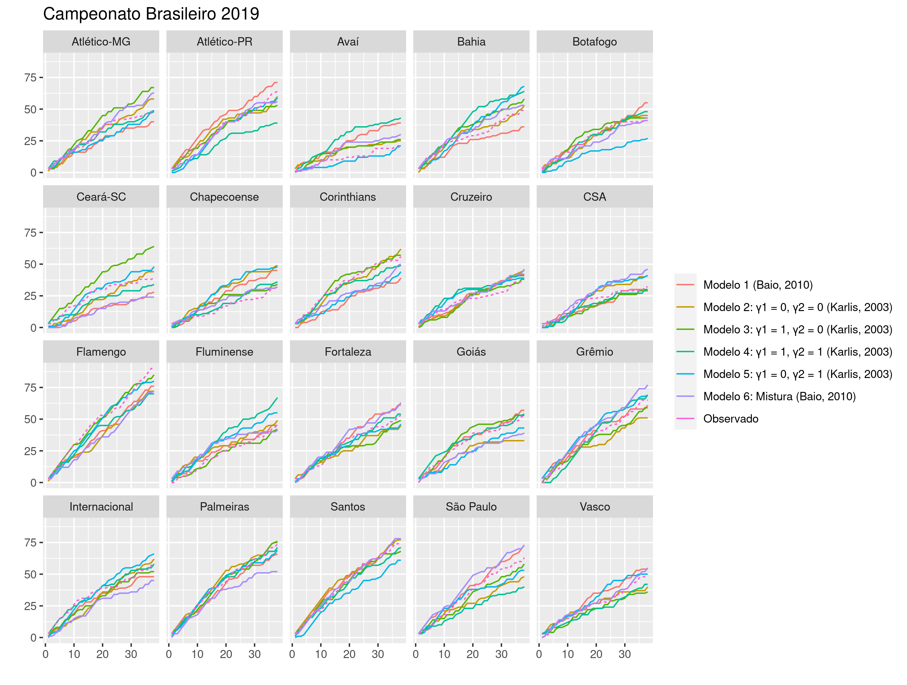

```{r setup, include=FALSE}
knitr::opts_chunk$set(echo = FALSE, fig.align = 'center')
options(knitr.kable.NA = '')

library(kableExtra)
library(knitr)
library(tidyverse)

source("src/wrangling_functions.R")
```

# 1. Introdução 

Modelos estatísticos podem ser aplicados em diferentes áreas do conhecimento. Uma delas, que tem crescido nos últimos anos, é a análise de dados de competições e eventos esportivos. O número de gols marcados, por exemplo, pode ser tratado como dados de contagem e representados por modelos discretos. Estes modelos são vastamente representados na literatura desde a década de 80, como em @pollard_69.9_1985 que utiliza a distribuição Binomial Negativa, enquanto @baxter_discriminating_1988 apresentam as diferenças entre a Binomial Negativa e Poisson para modelar o placar de partidas de futebol. Tais modelos desconsideram uma estrutura de correlação entre os gols de cada oponente. @karlis_analysis_2003 sugere a distribuição Poisson bivariada, que permite uma correlação entre o número de gols marcados pelo mandante e visitante e, ainda, há uma proposta de um modelo bayesiano hierárquico com efeitos aleatórios como definido por @baio_bayesian_2010. Neste trabalho, são implementados, ajustados e comparados modelos baseados na distribuição Poisson para dados do Campeonato Brasileiro de 2019, 2020 e 2021, obtido em @dados_brasileirao utilizando o software Stan e RStan para inferência bayesiana. 

# 2. Modelos 

Para o problema de contagem do número de gols em uma partida, o modelo mais comum é baseado na distribuição de Poisson. Essa distribuição é discreta, representando o número de eventos ocorridos em um intervalo de tempo. Uma das limitações dela é que sua média $\lambda$ e variância são iguais, portanto se há uma superdispersão nos dados, o modelo pode não ser tão apropriado. Todos os modelos que serão apresentados aqui são baseados nessa distribuição e ajustados aos dados do Campeonato Brasileiro, popularmente conhecido como Brasileirão, do ano de 2019.

## 2.1 Modelo 1

@baio_bayesian_2010 sugere um modelo bayesiano hierárquico para os gols marcados em uma determinada partida. No modelo proposto, o número de gols realizados segue uma distribuição Poisson condicionalmente independentes, em que a correlação é incluída por meio dos hiperparâmetros. A distribuição Poisson é vastamente utilizada para problemas de contagem e amplamente aplicada à análises esportivas como sugerem M. Dixon e S. Coles (2007) e D. Karlis e I. Ntzoufras (2003), dentre outros autores.

O vetor $\mathbf{y} = (y_{g1}, y_{g2})$ como um vetor de contagens, podemos tomar 

$$
y_{gj}|\theta_{gj} \sim Poisson(\theta_{gj})
$$
o vetor tendo uma distribuição Poisson condicional aos parâmetros $\mathbf{\theta}=(\theta_{g1}, \theta_{g2})$, que representam a taxa de pontuação no g-ésimo jogo para o mandante, representado por $j=1$ e o visitante $j=2$.

Assumindo um modelo log-linear de efeitos aleatórios, tem-se 
$$
\log \theta_{g1} = home + att_{h(g)} + def_{a(g)}
$$
$$
\log \theta_{g2} = att_{a(g)} + def_{h(g)}
$$
em que o parâmetro *home* é um efeito fixo representando a vantagem de ter um jogo em casa e a taxa de pontuação considera o *ataque* e a *defesa* dos dois times que estão jogando. Os índices representam o time que da casa $h(g)$ e o time visitante $a(g)$ no g-ésimo jogo.

### Priori

Considerando que o modelo proposto segue a abordagem bayesiana, os efeitos aleatórios são objetos aleatórios de interesse e é apropriado definir uma distribuição à priori para cada um deles. As prioris sugeridas pelos autores são:

$$
home \sim Normal(0, 0.0001)
$$
$$
att_t \sim Normal(\mu_{att}, \tau_{att})
$$
$$
def_t \sim Normal(\mu_{def}, \tau_{def})
$$
Sendo t cada um dos times do campeonato. A Normal é definida pela média e precisão. O modelo original foi implementado no WinBUGS, que utiliza a mesma parametrização apresentada no artigo. Como priori para $\mu$ é definida uma $Normal(0, 0.0001)$ tanto para o ataque quanto defesa, e $Gamma(0.1, 0.1)$ para os $\tau$ de ataque e defesa.

Nesse trabalho, o modelo foi implementado no Stan e uma adaptação foi necessária, considerando que a parametrização do software é diferente. A distribuição Normal é definida pela média e desvio padrão, então passamos a ter as prioris para os parâmetros:

$$
att_t \sim Normal(\mu_{att}, \sigma_{att})
$$
$$
def_t \sim Normal(\mu_{def}, \sigma_{def})
$$
Além disso, é necessário definir também as distribuições a priori dos hiperparâmetros. Para as médias, como não há conhecimento de informações que podem ser agregadas à priori, a escolha são prioris pouco informativas:

- $\mu_{att} \sim Normal(0, 10)$
- $\mu_{def} \sim Normal(0, 10)$

Conforme demonstrado por por @gelman_weakly_2008 e comentado em @apostilaStan, a priori não-informativa recomendada para o desvio padrão é uma Cauchy, portanto: 

$$
\sigma_{att} \sim Cauchy(0, 2.5)
$$
$$
\sigma_{def} \sim Cauchy(0, 2.5)
$$

Para garantir a identificabilidade do modelo, os autores sugerem a seguinte restrição nos parâmetros específicos de cada time: 

$$
\sum_{t=1}^{T} att_t = 0
$$
$$
\sum_{t=1}^T def_t = 0
$$
Ainda é proposto a restrição em que um dos times é definido como ataque e defesa iguais a 0, o que implica interpretar os parâmetros para os outros times utilizando como referência o time de base. A proposta foi implementada neste trabalho, então, a restrição de identificabilidade é: 
$$
att_T = 0
$$
$$
def_T = 0
$$
Tal restrição foi fundamental para que as cadeias de Markov convergissem, além de ser um método mais rápido para a execução do código.

### Simulação

Para checar a implementação dos modelos e estimação correta dos parâmetros, foi feita uma simulação com 1000 réplicas de tamanho 380, que é o número de jogos de um campeonato com 20 times. Os parâmetros do modelo usados para simulação são definidos como:

- $home = 0.13$
- $\mu_{att} = 0.05$
- $\mu_{def} = 0.08$
- $\sigma_{att} = 0.56$
- $\sigma_{def} = 0.52$


Observa-se que as distribuições da média da distribuição a posteriori dos parâmetros estão centradas em torno dos valores reais. 

#### Diagnóstico de convergência da simulação

As simulações foram realizadas com apenas 01 cadeia e 5000 interações. O gráfico traceplot mostra que a cadeia converge e consegue caminhar pelo espaço paramétrico.


Outra estatística útil é o $\hat{R}$, que próximo de 1 é condição para convergência. Todos os parâmetros apresentaram $\hat{R}$ próximo de 1, sendo o menor $\hat{R} = 0.9995999$ e maior $\hat{R} = 1.002963$.

### Ajuste 

Para verificar o comportamento do modelo com um conjunto de dados reais, assim como no artigo original o modelo é ajustado para dados do campeonato italiano, aqui ele será testado com dados do Campeonato Brasileiro do ano de 2019. 

O dados foram disponibilizados por @dados_brasileirao no Github, com o seguinte formato:

```{r}
df <- read_rds("/home/mariana/Documents/pessoal/monografia/soccer-models/dataframe_head.rds")

kable(df, booktabs = T) |> 
  kable_styling(position = "center", latex_options = "hold_position")
```

As colunas _home_team_index_ e _away_team_index_ foram criadas atribuindo um valor inteiro ordinal para cada time, seguindo a notação do modelo.

Comparando a pontuação **acumulada** ao longo do campeonato observada e a pontuação estimada pelo modelo, tem-se o seguinte comportamento para cada time:


Santos foi time com maior pontuação atribuída pelo modelo (78 pontos), estimando bem próximo da pontuação obtida e, assim, sendo o campeão segundo o modelo. Porém, o campeão de 2019 foi o Flamengo, que ficou em segundo lugar na pontuação estimada. Para o Fluminense, o erro foi de apenas 1 ponto. Em contrapartida, há estimativas subestimadas para Corinthians e Ceará.


```{r}
df <- read_rds("artifacts/2019/summary_m1.rds")
map_teams <- read_rds("artifacts/2019/index_teams.rds")
df <- cbind(df, map_teams) 

df <- df |> 
  select(home_team_name, mean, median, sd, q5, q95) |> 
  rename("Time" = home_team_name,
         "Média" = mean,
         "Mediana" = median, 
         "Desvio-padrão" = sd,
         "5%" = q5,
         "95%" = q95)

knitr::kable(
  df[1:20,],
  digits = 3,
  caption = 'Efeito de ataque de cada time, estimado pelo Modelo 1 ',
  booktabs = TRUE) |> 
  kable_styling(position = "center", 
                latex_options = "hold_position")

knitr::kable(
  df[21:40,],
  digits = 3,
  caption = 'Efeito de defesa de cada time, estimado pelo Modelo 1 ',
  booktabs = TRUE) |> 
  kable_styling(position = "center", 
                latex_options = "hold_position")
```

Os efeitos de ataque e defesa são interpretados com base na referência, definida anteriormente como o último time pelo seu índice. A última equipe é o Fortaleza.

## 2.2 Modelo 2

Conforme dito anteriormente, a distribuição Poisson é um dos modelos mais utilizados na literatura para análises do número de gols marcados em uma partida de futebol. As variáveis-resposta são usualmente modeladas como duas Poisson independentes, considerando que o número de gols de um time não afeta o número de gols do outro time. Tal suposição não é muito razoável, considerando, por exemplo, que a força de defesa de um time interfere nas oportunidades para a marcação de gols do oponente. A partir disso, @karlis_analysis_2003 sugerem a modelagem do número de gols a partir de uma Poisson bivariada, que permite a inclusão de uma covariância positiva que faz o papel da dependência entre as duas variáveis Poisson que, marginalmente, são independentes.

Sendo $X = X_1 + X_3$ e $Y = X_2 + X_3$, duas variáveis aleatórias com $X_i \sim Poisson(\lambda_i)$, então $X$ e $Y$ seguem conjuntamente uma Poisson bivariada $\mathbf{BP}(\lambda_1, \lambda_2, \lambda_3)$.

Conforme mencionado anteriormente, tem-se duas Poisson independentes marginalmente com $E(X) = \lambda_1 + \lambda_3$ e $Y = \lambda_2 + \lambda_3$. Além disso, $cov(X, Y) = \lambda_3$. Se $\lambda_3 = 0$, então temos simplesmente duas Poisson independentes. Os autores sugerem que o parâmetro $\lambda_3$ representam as condições de jogo comuns aos dois times da partida, como ritmo do jogo e condições climáticas. 

Contudo, tal modelagem tem uma limitação: levando em conta que a covariância entre X e Y também é o parâmetro da Poisson e o espaço paramétrico está definido em $(0, +\infty)$, a covariância também está limitada em $(0, +\infty)$. Isso significa que à medida que o número de gols de um dos times aumenta, o do outro time não tende a seguir a relação inversa e, por isso, a interpretação de condições favoráveis aos dois times simultaneamente. Porém, é razoável pensar que essa relação pode ser negativa, com o aumento do comportamento ofensivo de um time e a outra equipe sem muitas oportunidades de marcar gols.

Definindo diretamente o modelo aplicado à futebol, temos que para cada jogo i

$$
X_i \sim Poisson(\lambda_{1i})
$$
$$
Y_i \sim Poisson(\lambda_{2i})
$$
e usando a função de ligação log para os preditores lineares, tem-se:
$$
\log(\lambda_{1i}) = \mu + home + att_{h_i} + def_{g_i}
$$
$$
\log(\lambda_{2i}) = \mu + att_{g_i} + def_{h_i}
$$
Para a inclusão da covariância como $\lambda_3$, Karlis (2003) apresenta o preditor linear que permite combinar diferentes modelos: 
$$
\log(\lambda_{3i}) = \alpha^{con} + \gamma_1\alpha_{h_i}^{home} + \gamma_2\alpha_{g_i}^{away}
$$

No qual $\gamma_j$ é uma variável _dummy_, indicando quais parâmetros serão incluídos no modelo de interesse. Para o modelo 2, $\gamma_1 = \gamma_2 = 0$, ou seja, tem-se apenas uma covariância constante. 

No artigo original, ataque e defesa são tratados como efeitos fixos, portanto o número de parâmetros é o número de times multiplicado por dois mais 1, para o parâmetro que representa a covariância. Para os dados utilizados por Karlis do Campeonato Italiano de 1991-1992, são 37 parâmetros, enquanto para o Campeonato Brasileiro de 2019 seriam 41 parâmetros. Por isso, na adaptação do modelo, ataque e defesa foram abordados como efeitos aleatórios.

A restrição de identificabilidade dos efeitos de ataque e defesa é a mesma do modelo 1, com o efeito do último time definido como:
$$
att_T = 0
$$
$$
def_T = 0
$$

## Priori

A escolha das distribuições a priori deste modelo segue o mesmo princípio do modelo 1: prioris pouco informativas.

$$home \sim Normal(0, 10)$$
$$\sigma_{att} \sim Cauchy(0, 2.5)$$
$$\sigma_{def} \sim Cauchy(0, 2.5)$$
$$\mu \sim Normal(0, 10)$$
$$\alpha \sim Normal(0, 1)$$
$$\alpha^{home} \sim Normal(0, 1)$$
$$\alpha^{away} \sim Normal(0, 1)$$

### Simulação

Com o objetivo de verificar a estimação certa dos parâmetros, também foi feita uma simulação com 1000 réplicas de tamanho 380, representando o número de jogos de um campeonato com 20 times. Neste modelo, os parâmetros para simulação são definidos como:

- $home = 0.13$
- $\mu = 0.21$
- $\alpha = 0.20$
- $\sigma_{att} = 0.92$
- $\sigma_{def} = 0.80$

A partir dos resultados dos histogramas obtidos na simulação, tem-se que o modelo estima corretamente os parâmetros.


Com respeito às cadeias, a estatística $\hat{R}$ para os parâmetros se mostrou próxima de 1, sendo o menor $\hat{R} = 0.9995999$ e maior $\hat{R} = 1.002963$.

### Ajuste

Assim como o primeiro modelo, o modelo 2 foi ajustado para o Campeonato Brasileiro de 2019. Neste modelo, $\gamma_1=\gamma_2=0$. 


Santos e Palmeiras tem curvas ótimas da pontuação acumulada no campeonato. Algumas curvas vão se afastando ao longo da competição, como nota-se o Flamengo, São Paulo e Chapecoense.

## 2.3 Modelo 3

O modelo três é uma extensão do modelo 2, no qual $\gamma_1 = 1, \gamma_2=0$. Apenas o efeito fixo e o efeito que depende da equipe mandante são considerados no parâmetro de correlação $\lambda_3$. Não foi feita uma simulação para o modelo por limitações de memória no computador.


Diferentemente dos modelos anteriores, o terceiro modelo consegue acertar o time carioca como campeão, errando apenas por 5 pontos. As piores estimativas, em geral, foram para os times que não tiveram um desempenho tão notável negativa ou positivamente.

## 2.4 Modelo 4

O modelo quatro é uma extensão do segundo modelo, no qual $\gamma_1=1, \gamma_2=1$. Nesse caso, a correlação entre os gols do mandante e visitante depende do efeito fixo e dos efeitos de cada time. É a variação mais completa do modelo 2. Contudo, talvez ela fizesse mais sentido se suportasse uma covariância negativa, representando as condições reais para os dois times em campo. Também não foi realizada uma simulação pela mesma razão do modelo 3.


Observa-se um indicativo de o pior modelo ser o quarto. As curvas se afastam notavelmente para vários times, como Atlético Paranaense, Avaí e São Paulo. Ainda assim, o modelo foi capaz de acertar os times que estavam no _top_ 4 do Campeonato: Santos, Palmeiras, Flamengo e Grêmio.

## 2.5 Modelo 5

O modelo quatro é uma extensão do segundo modelo, que leva em consideração apenas o efeito fixo $\alpha$ e o efeito dependente do time visitante, sendo $\gamma_1=0, \gamma_2=1$. Também não foi realizada uma simulação por limitações computacionais.


O quinto modelo também não parece apresentar estimativas muito boas, como para o Botafogo, Bahia e Chapecoense. É compreensível que o modelo não tenha uma performance tão interessante, uma vez que ele desconsidera o efeito do mando de casa na dependência entre o número de gols, e há uma forte percepção do efeito do time da casa ser forte nos jogos competitivos. 

## 2.6 Modelo 6 

O sexto modelo é uma extensão do modelo 1, incluindo uma mistura de 3 componentes, indicando 3 categorias das habilidades do time. A partir disso, o efeito de ataque e defesa são definidos em função do grupo que a equipe pertence.

Neste modelo, o ataque e defesa seguem uma distribuição t com 4 graus de liberdade, **ponderados** pela probababilidade do time pertencer a um dos três grupos: (1) final da tabela, (2) meio da tabela e (3) topo da tabela (@baio_bayesian_2010).

$$
att_t = \sum_{k=1}^3 \pi^{att}_{kt} \times t(\mu^{att}_k, \tau^{att}_k, \nu)
$$
$$
def_t = \sum_{k=1}^3 \pi^{def}_{kt} \times t(\mu^{def}_k, \tau^{def}_k, \nu)
$$

## Priori

Novamente, define-se distribuições a priori para os parâmetros e hiperparâmetros do modelo. A probabilidade de pertencer ao grupo 1, 2 ou 3 é igual para todos os times, então define-se

- $\pi_{att} \sim Dirichlet([1, 1, 1])$ 
- $\pi_{def} \sim Dirichlet([1, 1, 1])$

Como é uma extensão do modelo 1, o efeito fixo de jogar em casa se mantém com a mesma priori $home \sim Normal(0, 10)$. 
Independentemente do grupo que o ataque e a defesa pertencem,  $\sigma_{att} \sim Cauchy(0, 2.5)$ e $\sigma_{def} \sim Cauchy(0, 2.5)$. As médias dos grupos que vão variar de acordo com qual _cluster_ o efeito vêm:

Grupo 1 

- $\mu_1^{att} \sim trunc Normal(0, 10, -3, 0)$
- $\mu_1^{def} \sim trunc Normal(0, 10, 0, 3)$

Grupo 2 

- $\mu_2^{att} \sim trunc Normal(0, 0.01)$
- $\mu_2^{def} \sim trunc Normal(0, 0.01)$

Grupo 3 

- $\mu_3^{att} \sim trunc Normal(0, 10, 0, 3)$
- $\mu_3^{def} \sim trunc Normal (0, 10, -3, 0)$

Um time que performa mal no campeonato possivelmente apresenta uma tendência de pontuar pouco e uma propensão a conceder gols ao adversário. Esta é a motivação de usar a distribuição Normal truncada como priori para os efeitos das médias de ataque e defesa.

### Diagnóstico das cadeias 

Para este modelo em específico, foram usadas duas cadeias para estimação das distribuições a posteriori, o parâmetro _thin_ igual a 5, descartando tal valor de amostras, e 10000 iterações.


As cadeias apresentaram problemas de convergência do parâmetro def_raw do vigésimo time. Além disso, parece haver uma correlação entre os parâmetros já próximo do fim das iterações. Portanto, o modelo foi incluído mas a inferência pode estar comprometida.

### Ajuste 


É importante considerar uma possível má especificação do modelo, por isso a análise deve ser realizada com cautela. Ele consegue estimar bem a pontuação de alguns times, por exemplo Santos, Botafogo e Chapecoense, apesar do leve afastamento em algumas rodadas da competição. Contudo, parece que as estimativas são otimistas para times que seriam considerados, popularmente, como topo da tabela, e pessimista para as equipes inferiores.

# 3. Comparação dos modelos

## 3.1 Erro quadrático médio

Um dos principais interesses em ajustar diferentes modelos é a comparação da qualidade de ajuste de cada um, com o objetivo de escolher o mais apropriado. 


A pontuação acumulada de todos os modelos ajustados está no gráfico acima, com o tracejado representando a pontuação observada. Observa-se que alguns modelos subestimam o desempenho de alguns times e outros são superestimados. Para auxiliar a visualização, a tabela abaixo apresenta os valores observados e estimados para cada time, além do erro quadrático médio de cada modelo.

```{r}
df <- read_rds("artifacts/2019/pontuacao_all.rds") 
df <- df |>
  rename("Time" = team_name,
         "Real" = score_obs,
         "M1" = score_est_m1, 
         "M2" = score_est_m2,
         "M3" = score_est_m3,
         "M4" = score_est_m4,
         "M5" = score_est_m5,
         "M6" = score_est_m6)

df2 <- df |> 
  select(starts_with("M")) |> 
  map_df(mse, actual = df$Real) |> 
  mutate(Time = NA, Real = NA) |> 
  mutate_if(is.numeric, round, 1)

df <- df |> 
  mutate_if(is.numeric, as.character)

rbind(df, df2) |> 
  kable(booktabs = T, digits = 1) |> 
  kable_styling(position = "center", 
                latex_options = "hold_position") |> 
  row_spec(c(3, 7, 9, 10, 11, 15, 17, 18), bold = TRUE) 
```

Os times em negrito são os melhores e os piores do campeonato. O modelo que chegou mais perto da pontuação do campeão Flamengo foi o modelo 3, que considera na correlação o efeito fixo e o do time mandante, enquanto as piores estimativas ficaram o segundo e o modelo de mistura.  

## 3.2 Validação cruzada

Medidas de qualidade relativa dos modelos são fundamentais para seleção de modelos e avaliação da acurácia preditiva dos modelos. 

@vehtari_practical_2015 propõe o cálculo do LOO-CV, que é feito baseado na esperança da densidadade preditiva do modelo.

- $elpd_{loo} = \sum_{i=1}^n \log p(y_i | y_{-i})$, onde $p(y_i|y_{-i}) = \int p(y_i | \theta) p(\theta|y_{-i}d\theta)$ é a densidade preditiva

- $LOO_{ic} = -2 \times elpd_{loo}$

- Quanto menor, melhor

Os valores obtidos para todos os modelos estão a seguir:

```{r}
read_rds("artifacts/2019/loo_compare_all_models.rds") |> 
  as_tibble(rownames = "model") |> 
  select(model, elpd_diff, se_diff, looic, se_looic) |> 
  mutate_if(is.numeric, round, 3) |> 
  kable(format = "latex", 
        booktabs = TRUE) |> 
  kable_styling(position = "center", 
                latex_options = "hold_position") 
```

A coluna looic indica o valor obtido para cada modelo. Já a coluna elpd_diff é a diferença entre os modelos, sendo o primeiro o modelo com o menor LOO, representando a diferença do melhor modelo e ele mesmo, assim em diante. É importante ressaltar novamente que, apesar da inclusão do modelo 6, como suas cadeias de Markov não estão adequadas, a inferência do modelo está comprometida. 

# 4. Outros modelos

Um possível problema com modelos hierárquicos é um efeito de encolhimento, no qual observações extremas são arrastadas para a média global. Esse efeito faz com que equipes com um desempenho muito bom, que estão no topo da tabela, têm estimativas conservadoras e os times que estão nas últimas colocações são superestimados. O encolhimento é um possível problema do modelo 1 e @baio_bayesian_2010 recomenda um modelo de mistura com três componentes para contornar esse efeito.

Uma outra possibilidade de mistura é um modelo inflado de zeros.

# 5. Conclusão
# 6. Referências
# 7. Apêndice

### 1. Traceplot para diagnóstico das cadeias

Abaixo, os _traceplots_ dos modelos ajustados com os dados do Campeonato Brasileiro. Como o número de parâmetros é muito grande, apenas alguns foram selecionados.

#### 1.1 Modelo 1 


#### 1.2 Modelo 2 


#### 1.3 Modelo 3 


#### 1.4 Modelo 4


#### 1.5 Modelo 5 


